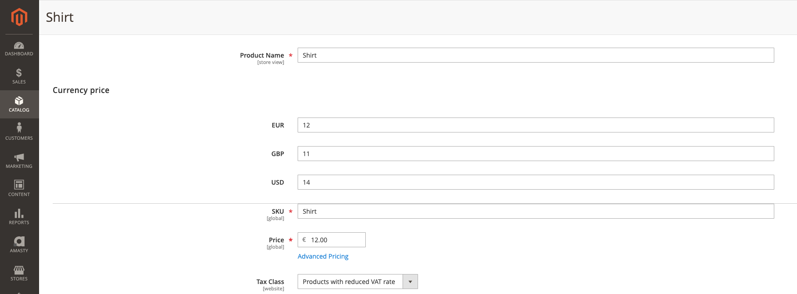
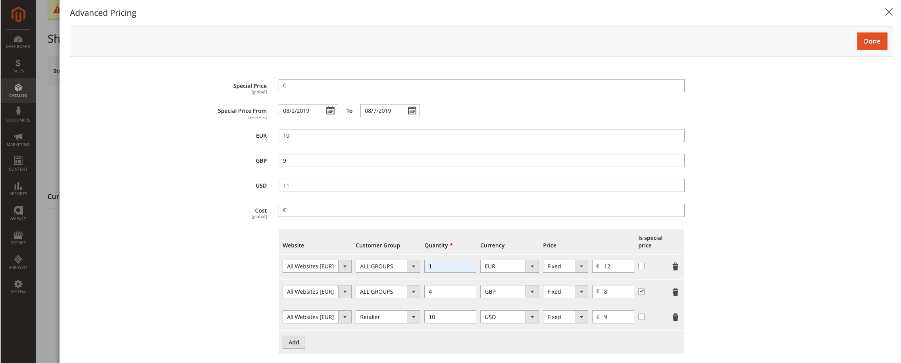

# magento2-ReachDigital_CurrencyPricing
This module provides the ability to set prices for products in a specific currency.
These currency prices will be used instead of the normal Magento table rates.
In this way, the shop owner has full control over the prices charge in any currency.
Currency prices can be set for the following price types:
- Base price
- Special price
- Tier price

Additionally tier prices get an 'Is special price' option. When checked for a tier price, it will be used as if it is a special price in that it will only be valid in the special price date interval.

This is what the currency prices look like for the base price:

In the Advanced pricing popup you can specify currency prices for the special price and the tier prices:

### Installation
Run `composer require reach-digital/magento2-currencypricing` to install the module.

Make sure that rates are set for all currencies that are supposed to be used. 
The rates are used as a fallback mechanism in case no price has been set for a product in the current currency.
If the rate is not set for the currency the base currency will be used instead, even if the price has been set for a product for the current currency.

### Limitations
The module currently only works for simple products and virtual products.
For other product types, the price indexer does not work correctly, so wrong prices could be displayed in the catalog.

This module conflicts with the [Amasty_Shopby](https://amasty.com/shop-by-brand-for-magento-2.html) module, causing an error on the catalog page.
To resolve this conflict, also install [this module](https://github.com/ho-nl/magento2-ReachDigital-CurrencyPricing-fix-Amasty_Shpoby) using `composer require reach-digital/magento2-currencypricing-fix-amasty-shopby`.

## FEATURE REQUESTS
- Allow to configure currency price per store view?
